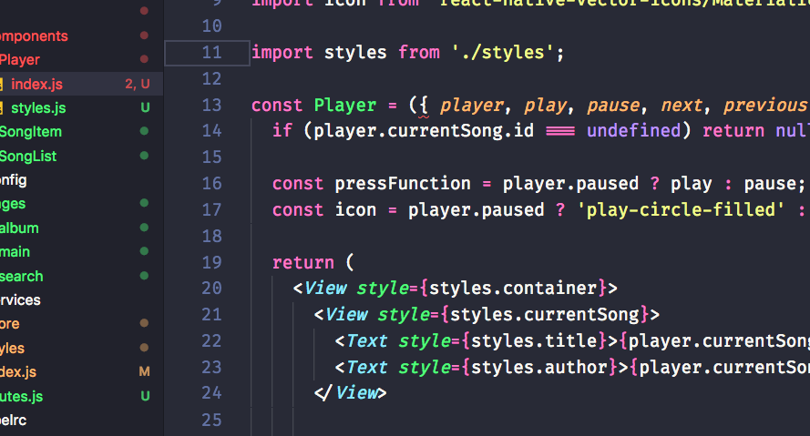
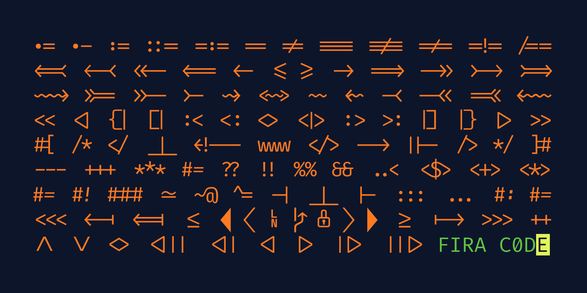
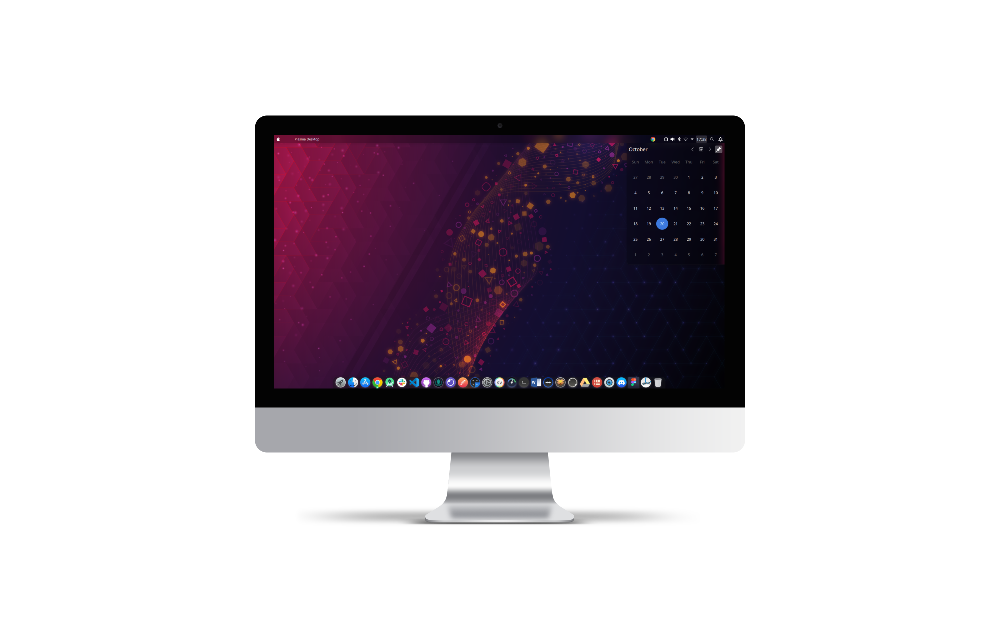

# Ambiente de Desenvolvimento

Uma das grandes dúvidas de maior interesse pelos desenvolvedores não é só de linguagem de programação, mas é quanto ao **ambiente de desenvolvimento**, melhores práticas, configurações, snippers, atalhos, etc.

Vou explicar como configurei meu **Visual Studio Code**, terminal e outras ferramentas que utilizo para aumentar a minha **produtividade** com Javascript desenvolvendo projetos em ReactJS, React Native e NodeJS.

Se você ainda usa **Windows** para programar recomendo seriamente repensar sobre isso e fazer um Dual Boot com Ubuntu ou outra distribuição Linux para melhorar sua produtividade. Garanto que não irá se arrepender 🤓


## Visual Studio Code
- Atualmente estou usando o Visual Studio Code, é um editor que recomendo muito. Já utilizei o Sublime Text, Brackets, Nodepad++ e até mesmo o bloco de notas e dentre eles o Visual Studio Code me atendeu melhor até agora.

<div align="center">
  
</div>

Além de ter a cara de editor como no *Sublime Text*, o VSCode não perde a funcionalidades de IDE como debug integrado com breakpoints, integração nativa com o it e autocomplete muito rápido.

Se você segue padrões de códigos e instala uma biblioteca como ESLint vai entender que no VSCode simplismente as coisas são bem flúdas. O terminal integrado ajuda muito quem utiliza notebook para programar.

  
## Plugins

Essa é a lista de plugins que tenho instalado até o momento:

* 🏃‍♂️ **[Code Runner](https://marketplace.visualstudio.com/items?itemName=formulahendry.code-runner)** - Plugin que ajuda a executa snippet de código ou arquivo de código para várias linguagens.

* 🕛 **[Code Time](https://marketplace.visualstudio.com/items?itemName=softwaredotcom.swdc-vscode)** - Plugin que utilizo para marca o tempo em que estou desenvolvendo.

* 🎨 **[Color Highlight](https://marketplace.visualstudio.com/items?itemName=naumovs.color-highlight)** - Esse plugin mostra a cor exata de todos os RGB's ou HEX em seu código, muito útil pra quem trabalha com **[CSS](https://developer.mozilla.org/pt-BR/docs/Web/CSS)** ou **[SASS](https://sass-lang.com/)**.

* 🖱️ **[DotENV](https://marketplace.visualstudio.com/items?itemName=mikestead.dotenv)** - Plugin que utilizo para ter suporte à sintaxe .env, bem útil para quem trabalha com **[NodeJS](https://nodejs.org/en/)**, **[ReatcJS](https://pt-br.reactjs.org/)** ou qualquer outro tipo de projeto web.

* 🧛‍♂️ **[Dracula Official](https://marketplace.visualstudio.com/items?itemName=dracula-theme.theme-dracula)** - Tema que utilizo no meu VSCode e em todos os outros editores/terminais, até o momento é o tema que mais me agradou.

* 💪 **[EditorConfig](https://marketplace.visualstudio.com/items?itemName=EditorConfig.EditorConfig)** - Plugin utilizado para padronizar quebra de linha, indentação, espaços e tabs entre desenvolvedores de um mesmo projeto.

* 🤙 **[LiveServer](https://marketplace.visualstudio.com/items?itemName=ritwickdey.LiveServer)** -  Conseguimos fazer alterações no editor de código, alternar para o navegador e atualizar para ver as alterações sem se perder alternando entre janelas.

* ✌️ **[Live Share](https://marketplace.visualstudio.com/items?itemName=MS-vsliveshare.vsliveshare)** - permite aos participantes da sessão visualizar ou editar o projeto no qual o grupo está trabalhando.

* 👻 **[Markdown All in One](https://marketplace.visualstudio.com/items?itemName=shd101wyy.markdown-preview-enhanced)** - Plugin que utilizo para escrever e ler Markdown dentro do VSCode, bem utilizados para documentações README's do Github.

* 🕶️ **[Material Icon Theme](https://marketplace.visualstudio.com/items?itemName=PKief.material-icon-theme)** - Utilizo para exibir os ícones de acordo com a linguagem utilizada na minha sidebar. O mais legal é que ele identifica a grande parte das Libs e Ferramentas.

* 🚀 **[Rocketseat ReactNative](https://marketplace.visualstudio.com/items?itemName=rocketseat.RocketseatReactNative)** - Plugin com React Native Snippets da Rocketseat.

* ✈️ **[Rocketseat ReactJS](https://marketplace.visualstudio.com/items?itemName=rocketseat.RocketseatReactJS)** - Plugin com ReactJS Snippets da Rocketseat.

* 👀 **[SQLite](https://marketplace.visualstudio.com/items?itemName=alexcvzz.vscode-sqlite)** - Plugin utilizado para explorar e consultar bancos de dados SQLite de alguns projetos que faço em Backend.

* 🧑🏽‍💻 **[Tabnine](https://www.tabnine.com/)** - Essa é uma extensão para auto-completar seu código. Porém ela faz uso de inteligência artificial pra você codar mais rápido já que ela identifica padrões no seu código e assim melhora a qualidade das sugestões.

* 💅 **[vscode-styled-components](https://marketplace.visualstudio.com/items?itemName=jpoissonnier.vscode-styled-components)** - Destaque de sintaxe e IntelliSense para componentes estilizados.

## Configurações
Além dos plugins, utilizo algumas configurações para facilitar a legibilidade e edição do código. Para aplicar essas configurações você precisa acessar suas preferências.

```sh
Define o tema do VSCode
    "workbench.colorTheme":"Dracula",

  // Configura tamanho e família da fonte
    "editor.fontSize": 14,
    "editor.lineHeight": 20,
    "editor.fontFamily": "Fira Code",
    "editor.fontLigatures": true,

  // Aplica linhas verticais para lembrar de quebrar linha em códigos muito grandes
   "editor.rulers": [80, 120],
  
  // Aplica um sinal visual na esquerda da linha selecionada
    "editor.renderLineHighlight":"gutter",

  // Aumenta a fonte do terminal
    "terminal.integrated.fontSize":12,

  // Define o tema dos ícones na sidebar
    "workbench.iconTheme": "material-icon-theme",
}
```
## Terminal

Apesar de ajudar muito o terminal integrado do VSCode, utiizo um terminal com algumas modificações que acho bem legal.

- **[Oh My Zsh (apenas Mac e Linux)](https://ohmyz.sh/#install)**
  é um dos melhores pacotes que você pode utilizar para dar um *Tchan* no seu terminal. Essa biblioteca permite configurar plugins, temas e diversas outras coisas dentro do terminal.

- **[Git Terminal (pode ser usado no Mac e Linux)](https://git-scm.com/downloads)** Recomendo bastante para que está usando o Windows. Essa biblioteca também permite configurar plugins, temas e diversas outras coisas dentro do terminal igual ao ZSH.

- **[Fonte FiraCode](https://github.com/tonsky/FiraCode)** Essa sem dúvidas é uma das minhas fontes favorita. Além de ter a escrita muito bonita, é composta por uma personalidade única que contém um conjunto de ligaduras para combinações de vários caracteres de programação, deixando o código mais "bonito" de se ver. 

<div align="center">
  
</div>


## Ferramentas

Além do Visual Studio Code e do terminal utilizo também algumas ferramentes que me ajudam muito durante os estudos. Tomei a liberdade e criei um **[Script](https://github.com/RaioneNascimento/rn-workstation)** compatível com as distros debian/ubuntu, com o foco de preparar o ambiente instalando os programas que mais utilizo, facilitando a instalação e economizando tempo depois da instalação do Sistema operacional.

 - **[DevDocs](https://devdocs.io/)** - Para baixar e consultar documentações das principais linguagens e bibliotecas existentes.
 - **[Insomnia](https://insomnia.rest/download/)** - Aplicativo para testar API's REST, muito útil. É possível configurar variáveis de ambiente e trabalhar em times 
 - **[Figma](https://www.figma.com/downloads/)** - Editor gráfico de vetor e prototipagem de projetos de design baseado principalmente no navegador web, com ferramentas offline adicionais para aplicações desktop para Linux, macOS e Windows. 
 - **[Notion (apenas Mac e Windows)](https://www.notion.so/desktop)** - Aplicativo e serviço completo para anotações, gerenciamento de projetos e de tarefas.s

## Software

No momento estou utilizando o **[Ubuntu 20.04](https://ubuntu.com/download/desktop)** com o **[KDE Plasma 5](https://kde.org/plasma-desktop)** que remete bastante a aparência do novo sistema macOS Big Sur da Apple.

<div align="center">
  
</div>


## Hardware

Atualmente estou usando o notebook da **[DELL Inspiron 15 5557](https://downloads.dell.com/manuals/all-products/esuprt_laptop/esuprt_inspiron_laptop/inspiron-15-5557-laptop_reference%20guide_pt-br.pdf)**. Esse notebook 
tem sido meu companheiro de estudo/desenvolvimento durante todo o tempo.

## Playlists

E para finalizar, essas são as playlists que escuto para programar/trabalhar:

- [Rock Anos 70, 80 e 90](https://www.youtube.com/playlist?list=PL_Q15fKxrBb6c-G3SIk5-Efl4HztFfmfm)
- [Rock Anos 90 & 2000](https://www.youtube.com/playlist?list=PL_Q15fKxrBb7G6Y3K-n3N_2GetrgJHwET)
- [Summer Hits 2020 - Eletrônicas](https://www.youtube.com/playlist?list=PLM40JcvMsqlgGAE_3gDwI1RJlmvNufXBi)
- [Playlist Músicas 2018 - Eletrônicas](https://www.youtube.com/watch?v=0t2tjNqGyJI&list=PLiThvUqDAHmug41V3TEptjoBn-AVRZeAq&ab_channel=TrapNation)

`made with 💜 by raionedeveloper © 2020`
